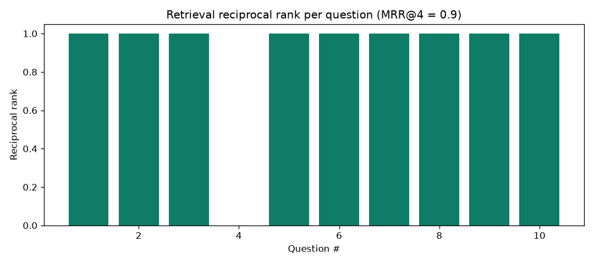
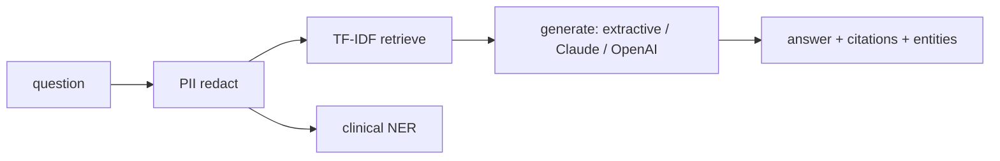

# clinical-rag-assistant

[](https://github.com/bushra-nazeer/clinical-rag-assistant/actions/workflows/ci.yml)


A retrieval-augmented **clinical Q&A** assistant: a **PII guardrail** → **TF-IDF
retrieval** over a clinical reference corpus → **dictionary clinical NER** →
**grounded answer generation** with citations, served via FastAPI. The
generation backend is **configurable** (offline extractive default, or hosted
**Claude / OpenAI**) and the whole thing runs with **zero downloads**.

> Educational demo only, not medical advice; uses no PHI. Metrics below are from
> a real `make evaluate` run.

## Retrieval quality (QA eval set)

| Metric @4 | Value |
|---|---|
| Hit-rate | **0.90** |
| MRR | **0.90** |
| Recall | **0.90** |



## Example: `/ask` with a PII-laden question

Request: *"For patient MRN 4471230 and SSN 123-45-6789, what is first-line
treatment for type 2 diabetes?"*

```json
{
  "question": "For patient [REDACTED_MRN] and SSN [REDACTED_SSN], what is first-line treatment for type 2 diabetes?",
  "answer": "First-line pharmacologic therapy for type 2 diabetes is metformin, alongside lifestyle modification. The general A1C target for many non-pregnant adults is below 7% ... (Sources: DM-MGMT, DM-DX)",
  "citations": [
    {"doc_id": "DM-MGMT", "title": "Type 2 Diabetes, Management", "score": 0.298},
    {"doc_id": "DM-DX", "title": "Type 2 Diabetes, Diagnosis", "score": 0.230}
  ],
  "entities": [{"text": "type 2 diabetes", "type": "CONDITION", "code": "E11.9", "start": 84}],
  "pii_redacted": ["MRN", "SSN"]
}
```

The MRN and SSN are **redacted before retrieval**, the answer is **grounded in
cited passages** (nothing outside the corpus), and the clinical entity is
extracted and coded.

## Configurable backends (pluggable, identical interfaces)

| Stage | Default ($0, offline) | Production upgrade |
|---|---|---|
| Retrieval | TF-IDF + cosine | transformer embeddings + FAISS / Chroma / Milvus |
| Clinical NER | dictionary gazetteer | scispaCy / BioBERT |
| Generation | extractive + citations | hosted LLM (`llm.provider: anthropic` / `openai`) |

Set `llm.provider` in `config.yaml`; the API backends are lazily imported and
fall back to extractive if the SDK/key is absent, so it always runs.

## Architecture



## Demo

An interactive Streamlit app (`streamlit_app.py`) lets you ask a clinical question and see the grounded answer, citations, and detected entities. Run it locally with `streamlit run streamlit_app.py`, or deploy it free on [Streamlit Community Cloud](https://streamlit.io/cloud) by connecting this repo and setting the main file to `streamlit_app.py`.

## Quickstart

```bash
docker compose up --build api          # serve at http://localhost:8000

make install
make index        # build the TF-IDF index
make evaluate     # retrieval metrics + chart
make ask Q="how is asthma controlled long term?"
make serve        # FastAPI at http://localhost:8000
make test         # pytest    |    make lint
```

```bash
curl "localhost:8000/ask?q=how%20is%20asthma%20controlled%20long%20term"
```

## Repository layout

```
src/clinical_rag/   corpus · pii · ner · retriever · generate · rag · evaluate
src/clinical_rag/api/   FastAPI /ask, /health
tests/              pii, ner, corpus, retriever, rag, evaluate, API
```

## License

[MIT](LICENSE)
