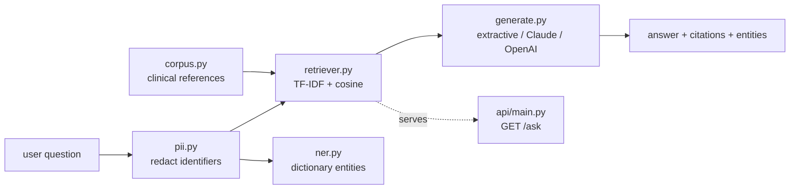

# Architecture

## RAG pipeline

## Configurable backends (pluggable, identical interfaces)

| Stage | Default (this repo, $0, offline) | Production upgrade |
|---|---|---|
| Embeddings / retrieval | TF-IDF + cosine | transformer embeddings + FAISS / Chroma / Milvus |
| Clinical NER | dictionary gazetteer | scispaCy / BioBERT |
| Generation | extractive grounded answer | hosted LLM (`anthropic` / `openai` backends) |

The generation backend is selected in `config.yaml` (`llm.provider`). The
`anthropic` / `openai` paths are lazily imported and fall back to extractive if
the SDK or API key is missing — so the repo always runs.

## Guardrails & grounding

- **PII guardrail** (`pii.py`) redacts SSN/MRN/email/phone/dates *before* the
  query reaches retrieval or any hosted LLM — HIPAA-conscious by construction.
- **Grounding**: answers are built only from retrieved passages and carry
  `doc_id` citations; nothing is fabricated outside the corpus.

## Modules

| Module | Responsibility |
|---|---|
| `corpus.py` | Clinical reference passages + QA eval set |
| `pii.py` | Detect + redact PII |
| `ner.py` | Dictionary clinical entity extraction |
| `retriever.py` | TF-IDF index + cosine retrieval |
| `generate.py` | Configurable answer generation |
| `rag.py` | Orchestrate redact → retrieve → NER → generate |
| `evaluate.py` | Retrieval metrics (hit-rate, MRR, recall) |
| `api/` | FastAPI `/ask`, `/health` |
